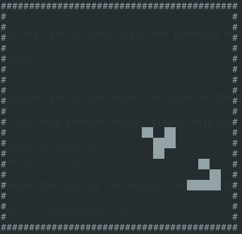

# Infinite Game of Life

An (essentially) infinitely scalable Python 3 implementation of [Conway's Game of Life](https://en.wikipedia.org/wiki/Conway%27s_Game_of_Life).

To run:

    python3 game_of_life.py

The program will then begin with several prompts:

    Type anything to generate new pattern (else press enter): yes pls

Typing any text in this field and pressing enter will allow you to generate a blank input file

    Width: 5
    Height: 5
    
This allows you to customise the size of the generated file. Make sure it is big enough to contain all the cells in your initial state. Note: the dimensions don't need to be exact.

After you have pressed enter, simply edit the file and replace any `.` (dead) cells with `@` (alive) cells. Don't forget to save before pressing enter in the terminal.

    Width of view: 20
    Height of view: 20

Customise the size of the output 'window'. The viewed area will be centered over the (0, 0) origin. Make sure that your terminal window is wide enough/tall enough to view the specified area.

    No. of generations: 50

Number of generations, evolutions, or 'frames' to display.

Finally, press enter, and the simulation will be played back to you!

## Example 'drawings'

Glider:

    .@.
    ..@
    @@@

Try searching on the internet for more examples.